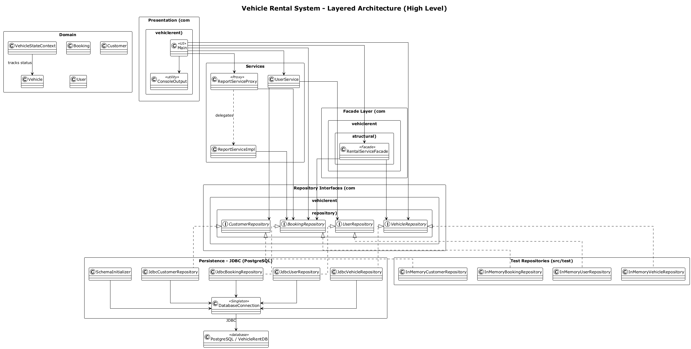
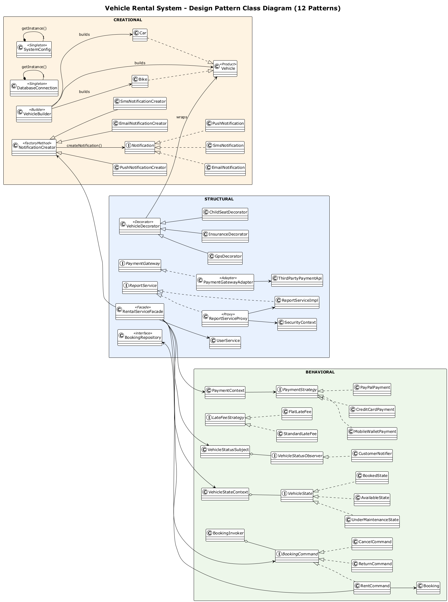

# Vehicle Rental System — Project Report

> **STATUS: Final content complete** — only Appendix B screenshots and the
> cover-page personal details (name, ID, module, college) remain to be added.

---

## 1. Cover Page

| Field | Value |
|---|---|
| Project Title | Vehicle Rental System |
| Module | [Module Code / Name] |
| Student Name | [Your Name] |
| Student ID | [Your Student ID] |
| College / University | [College Name] |
| Assessment | Coursework — Artefact (50%) |
| Submission Date | 28 July 2026 |
| Programming Language | Java 17 (Maven), PostgreSQL |

---

## 2. Problem Statement

Traditional vehicle rental businesses manage bookings, vehicle availability, payments and
customer records manually or with spreadsheets. This leads to:

- **No centralized booking records** — double-booking and lost revenue.
- **Inconsistent business logic** — rental, payment and notification rules scattered across code.
- **No late-return enforcement** — customers returning vehicles late pay nothing extra.
- **No security** — any user can view business reports.
- **Hard-to-maintain code** — new payment methods or add-on features require rewriting core logic.

This project solves these problems by building a **console-based Vehicle Rental System** whose
architecture is organized with **12 GoF design patterns** from all three categories, ensuring
the system is **modular, extensible, secure, and easy to maintain**.

---

## 3. Functional Requirements

### FR1 — User Management
- Register customers (name, email, phone, **username**, password).
- Login with username + password; roles: **ADMIN** and **CUSTOMER**.

### FR2 — Core Business Process (Rental Workflow)
- Browse available vehicles; rent a Car or Bike for a chosen number of days.
- Optional add-ons per day: GPS ($15), Insurance ($25), Child Seat ($10).
- Payment via Credit Card, PayPal or Mobile Wallet (user-chosen).
- Return a vehicle — with a **late-return fine** when returned after the agreed days.
- Cancel an active booking.

### FR3 — Notifications
- SMS confirmation sent to the customer after a successful booking.

### FR4 — Reports
- Revenue Report (total income, number of bookings).
- Rental History Report (all booking records).

### FR5 — Status Tracking
- Vehicles: `Available → Booked → Available / UnderMaintenance`.
- Bookings: `CONFIRMED → COMPLETED / CANCELLED`.

### FR6 — Security
- Admin-only access to reports; logged-out or customer access returns `Access Denied`.

---

## 4. Architecture Design

The system follows a **layered architecture** with dependencies pointing inward:

```
Presentation (Main)
      ↓
Facade (structural.RentalServiceFacade)
      ↓
Services (UserService, structural.ReportServiceProxy)
      ↓
Repository Interfaces ← JDBC Implementations (PostgreSQL) | In-Memory (tests)
```

- **UI layer**: `Main` — interactive numbered menus, formatted output via `ConsoleOutput`
  (pattern-labeled headings, e.g. `==== STRATEGY PATTERN - PAYMENT PROCESSING ====`).
- **Facade layer**: `structural.RentalServiceFacade` exposes one simple entry point for
  rent / cancel / return and hides payment, booking, state and notification subsystems.
- **Pattern layer**: the 12 patterns live in three packages — `creational/`, `structural/`,
  `behavioral/` — each class documented with its pattern role and rationale.
- **Repository layer**: interfaces (`BookingRepository`, `VehicleRepository`, ...) with
  two implementations each — `Jdbc*` (PostgreSQL) for the real app and `InMemory*` for JUnit tests.
- **Database**: PostgreSQL schema managed by `SchemaInitializer` (`schema.sql`):
  tables `users`, `customers`, `vehicles`, `bookings` (incl. `late_fee` column).

**SOLID highlights**: repositories depend on interfaces (DIP); each class has one
responsibility (SRP); patterns are open for extension (OCP) — e.g. adding a new payment
method or fine strategy needs no changes to existing classes.

### Architecture Diagram



---

## 5. Design Pattern Mapping

| # | Pattern | Category | Package | Key Classes | Where it fires |
|---|---------|----------|---------|-------------|----------------|
| 1 | Singleton | Creational | `creational/` | `SystemConfig`, `DatabaseConnection` | App startup — single config + single DB connection |
| 2 | Factory Method | Creational | `creational/` | `NotificationCreator` + `Email/Sms/PushNotificationCreator` | Booking confirmation — SMS created by factory |
| 3 | Builder | Creational | `creational/` | `VehicleBuilder` (+ `Car`, `Bike` in `vehicle/`) | Vehicle objects constructed step-by-step |
| 4 | Decorator | Structural | `structural/` | `VehicleDecorator`, `Gps/Insurance/ChildSeatDecorator` | "Add GPS?" prompts — add-ons wrap the vehicle |
| 5 | Adapter | Structural | `structural/` | `PaymentGatewayAdapter`, `ThirdPartyPaymentApi` | Every payment — legacy API adapted to internal gateway |
| 6 | Facade | Structural | `structural/` | `RentalServiceFacade` | Rent / cancel / return entry point |
| 7 | Proxy | Structural | `structural/` | `ReportServiceProxy`, `ReportServiceImpl` | Report generation — access control |
| 8 | Strategy | Behavioral | `behavioral/` | `PaymentStrategy` + `CreditCard/PayPal/MobileWallet`; `LateFeeStrategy` + `Standard/FlatLateFee` | Payment method choice; late-return fine policy choice |
| 9 | Observer | Behavioral | `behavioral/` | `VehicleStatusSubject`, `CustomerNotifier` | Vehicle status change → notify observers |
| 10 | Command | Behavioral | `behavioral/` | `BookingInvoker`, `Rent/Cancel/ReturnCommand` | Each user action executed as a command |
| 11 | State | Behavioral | `behavioral/` | `VehicleStateContext` + `Available/Booked/UnderMaintenanceState` | Vehicle lifecycle transitions |

### Pattern Class Diagram



---

## 6. Pattern Justification (summary)

| Pattern | Problem it solves | Why this pattern | Alternative rejected |
|---|---|---|---|
| Singleton | Multiple DB connections / duplicate config | One shared connection + one config | Static globals (no lazy init, no testability) |
| Factory Method | Hard-coded notification types | Client code doesn't know concrete notifier | Direct `new SmsNotification()` everywhere |
| Builder | Car/Bike with many optional attributes | Step-by-step construction, readable | Telescoping constructors |
| Decorator | Many optional add-on combinations | Wrap to add price/features at runtime | Subclass explosion (GPS+Insurance+ChildSeat × car/bike) |
| Adapter | Third-party payment API incompatible | Translate internal gateway calls | Rewriting third-party code |
| Facade | Complex subsystem usage | Single simple API for Main | Main depending on all subsystem classes |
| Proxy | Reports must be admin-only | Gate access before real work | Inline if-checks in every report method |
| Strategy | Payment methods / fine policies vary | Swap algorithms at runtime | if/else chains |
| Observer | Notify interested parties on status change | Loose coupling via subscription | Polling status manually |
| Command | Rent/cancel/return as undoable actions | Encapsulate action + state as object | Direct method calls with repeated state code |
| State | Vehicle status rules (can't rent booked car) | Behavior depends on state, transitions centralized | if/else on status strings everywhere |

### Pattern-by-pattern justification

**1. Singleton** — `SystemConfig` and `DatabaseConnection` both use a `volatile`
instance with double-checked locking in `getInstance()`, giving thread-safe lazy
initialization of one shared configuration object and one JDBC connection manager.
This prevents conflicting settings (e.g. different DB credentials) and avoids opening
a new connection factory for every repository call. A static global was rejected
because it cannot be lazily initialized and is harder to test.

**2. Factory Method** — `NotificationCreator` declares `createNotification()`, and
`EmailNotificationCreator`, `SmsNotificationCreator` and `PushNotificationCreator`
each return their own `Notification` implementation. `Main` asks for an SMS
notification after booking without ever naming a concrete class, so a new channel
(e.g. WhatsApp) can be added as one new Creator + Notification pair with zero changes
to existing client code.

**3. Builder** — `Car` and `Bike` have many optional attributes, so `VehicleBuilder`
constructs them step-by-step (`withBrand()`, `withDailyRate()`, …) and returns a fully
configured product. This is more readable than long telescoping constructors and
makes the construction of the demo vehicles in `VehicleFactory` explicit and
self-documenting.

**4. Decorator** — optional add-ons (GPS, Insurance, Child Seat) are `VehicleDecorator`
subclasses that wrap a `Vehicle` and add their daily price on top of the base rate.
This avoids a class explosion (Car+Gps, Car+Gps+Insurance, Bike+ChildSeat, …) and lets
the user combine add-ons freely at runtime without touching the `Car`/`Bike` classes.

**5. Adapter** — `ThirdPartyPaymentApi` exposes an incompatible legacy interface, so
`PaymentGatewayAdapter` implements the internal `PaymentGateway` interface and
translates every call (including `processPayment`) into the legacy API's own format.
The rest of the system depends only on the stable `PaymentGateway` contract.

**6. Facade** — `RentalServiceFacade` provides `rentVehicle()`, `cancelBooking()` and
`returnVehicle()` as single entry points, hiding the payment context, state machine,
subject/observer registry, command invoker and repositories from `Main`. Without it,
the presentation layer would have to wire up every subsystem class directly.

**7. Proxy** — `ReportServiceProxy` wraps the real `ReportServiceImpl` and checks
`SecurityContext` before delegating: no user logged in → *Access Denied*; non-admin →
*Access Denied*; admin → *Access Granted* then the real report is generated. Security
stays out of the report logic itself and can be applied to any future service.

**8. Strategy** — two interchangeable families: `PaymentStrategy`
(`CreditCardPayment`, `PayPalPayment`, `MobileWalletPayment`) selected at checkout, and
`LateFeeStrategy` (`StandardLateFee` = 50% of the daily rate per late day, `FlatLateFee`
= fixed $25 per day) chosen at vehicle return. `PaymentContext` and the return flow
hold only the interface, so policies are swapped at runtime with no `if/else` chains.

**9. Observer** — `VehicleStatusSubject` keeps a list of `VehicleStatusObserver`s and
broadcasts every state change (e.g. *Available → Booked*); `CustomerNotifier` reacts by
printing a notification. A vehicle can gain new interested parties (audit logger,
dashboard) without the state machine knowing about them.

**10. Command** — each user action is an object: `RentCommand`, `CancelCommand`,
`ReturnCommand`, all implementing `BookingCommand`, executed by `BookingInvoker`.
This separates the action from its execution, keeps repeated state-management code out
of `Main`, and each command can be reused, logged or undone.

**11. State** — `VehicleStateContext` owns a `VehicleState`
(`AvailableState`, `BookedState`, `UnderMaintenanceState`) and delegates behaviour such
as `rent()`/`return()` to it, so rules like *"a booked vehicle cannot be rented"* live
in one place instead of scattered `if/else` checks on status strings. Transitions are
enforced centrally, and `VehicleStateTest` covers the invalid-action cases.

**12. Strategy (fine policy) doubling** — the late-return fine is the second use of the
Strategy family: it proves the pattern scales to any swappable policy, and the fine is
persisted to the `bookings.late_fee` column so reports reflect real revenue.

---

## 7. JUnit Test Cases

**11 test classes, 39 tests — all passing** (`mvn test` → BUILD SUCCESS).

| Test Class | Package | Tests | Verifies |
|---|---|---|---|
| `SystemConfigTest` | `creational/` | 2 | Singleton config values |
| `NotificationFactoryTest` | `creational/` | 3 | Factory Method creates correct notification types |
| `VehicleBuilderDecoratorTest` | `vehicle/` | 4 | Builder builds vehicles; decorators add price correctly |
| `PaymentPatternTest` | `behavioral/` | 5 | Strategy payment + Adapter transaction |
| `ObserverPatternTest` | `behavioral/` | 2 | Status change broadcast |
| `VehicleStateTest` | `behavioral/` | 5 | State transitions + invalid actions |
| `BookingCommandTest` | `behavioral/` | 4 | Command pattern: rent/cancel/return commands |
| `LateFeeStrategyTest` | `behavioral/` | 3 | Fine strategies interchangeable |
| `RentalWorkflowTest` | `structural/` | 4 | Full rent→return workflow + late-fine calculation |
| `ReportServiceProxyTest` | `structural/` | 3 | Proxy denies non-admin / logged-out users |
| `UserServiceTest` | `user/` | 4 | Username login, duplicate username rejected |

**Example result excerpt (from `mvn test`):**
```
Tests run: 39, Failures: 0, Errors: 0, Skipped: 0
BUILD SUCCESS
```

---

## 8. Conclusion

The Vehicle Rental System demonstrates how **creational, structural and behavioral design
patterns collaborate inside one real-world application**: a single rental action travels
through Builder → Decorator → Facade → Strategy (payment) → Adapter → Command → State →
Observer → Factory Method (notification), while Singleton/Proxy/Factory Method and the
late-fine Strategy keep the system configurable, secure and data-persistent. All 39 JUnit
tests pass, and every console screen is labeled with the active pattern so the design is
auditable end-to-end.

---

## Appendix A — How to Run

1. Start PostgreSQL, create database `VehicleRentDB` (config in `src/main/resources/database.properties`).
2. `mvn clean test` — runs all 39 tests (no DB needed).
3. `mvn exec:java` or run `Main` in IntelliJ — schema + demo data auto-create on startup.
4. Demo login: `admin` / `admin123`; demo vehicles: CAR001 (Toyota Corolla $50),
   CAR002 (BMW X5 $120), BIKE001 (Honda CB500 $20).

---

## Appendix B — Screenshots

Capture each flow in the console and paste the screenshot into the space provided
below its label (replace the placeholder line with the image). Keep the console window
wide enough to show the pattern headings.

### B.1 — Main menu + registration
Shows the main menu and the `USER MANAGEMENT - CUSTOMER REGISTRATION` heading.

**`[ PASTE SCREENSHOT B.1 HERE ]`**

*Caption: Customer registration screen.*

### B.2 — Login as admin
Shows the `USER MANAGEMENT - LOGIN` heading and successful login.

**`[ PASTE SCREENSHOT B.2 HERE ]`**

*Caption: Admin login with username `admin`.*

### B.3 — Rent flow (full pipeline)
Shows, in order: `BUILDER PATTERN - VEHICLE CONSTRUCTION`, `FACADE PATTERN - RENTAL
SERVICE`, `STRATEGY PATTERN - PAYMENT PROCESSING`, `ADAPTER PATTERN - PAYMENT
GATEWAY`, `STATE PATTERN - VEHICLE STATUS`, `OBSERVER PATTERN - STATUS NOTIFICATION`,
`FACTORY METHOD PATTERN - NOTIFICATION`, and the final price breakdown with add-ons.

**`[ PASTE SCREENSHOT B.3 HERE ]`**

*Caption: Complete rental workflow — patterns visible end to end.*

### B.4 — My bookings
Shows the customer's active booking listed with status `CONFIRMED` and the late-fee
column.

**`[ PASTE SCREENSHOT B.4 HERE ]`**

*Caption: Booking list showing CONFIRMED status.*

### B.5 — Return flow with late fee
Shows the return prompt, the days-late question, the fine-strategy choice
(`1 = Standard` / `2 = Flat`), the `LATE FINE` breakdown, and confirmation that the
fine was applied and persisted.

**`[ PASTE SCREENSHOT B.5 HERE ]`**

*Caption: Late return — fine calculated with the Strategy pattern.*

### B.6 — Revenue report as admin
Shows `PROXY PATTERN - SECURE REPORT ACCESS`, `Access Granted`, and the revenue
summary (total income, number of bookings).

**`[ PASTE SCREENSHOT B.6 HERE ]`**

*Caption: Admin generating the revenue report through the proxy.*

### B.7 — Report access denied (customer)
Shows `Access Denied: <username> lacks admin privileges.` when a customer tries to
generate a report.

**`[ PASTE SCREENSHOT B.7 HERE ]`**

*Caption: Proxy blocks a non-admin user from report access.*
